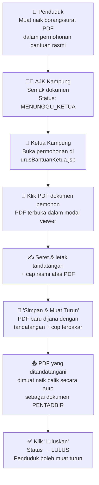

# E-Tandatangan & Cap Rasmi Ketua Kampung — Implementation Plan (v2)

Membolehkan Ketua Kampung **membuka PDF borang/surat yang dimuat naik oleh penduduk**, meletakkan tandatangan digital dan cap rasmi **terus di atas PDF tersebut**, dan memuat naik semula PDF yang telah ditandatangani — **semua tanpa keluar dari sistem**.

---

## Aliran Kerja Sebenar



> [!IMPORTANT]
> **Perbezaan utama dari plan v1**: Kita TIDAK menjana surat baru. Kita membuka PDF sedia ada yang dimuat naik oleh penduduk, tampalkan tandatangan + cop di atasnya, dan muat naik semula PDF yang telah diproses.

---

## Proposed Changes

---

### Component 1: Database — Signature & Stamp Storage (One-Time Setup)

Ketua Kampung simpan tandatangan + cap rasmi **sekali sahaja** dalam profil. Selepas itu, setiap kali nak tandatangan PDF, sistem auto-ambil dari sini.

#### SQL Query (User executes manually)

```sql
ALTER TABLE `pengguna` 
  ADD COLUMN `digital_signature` LONGTEXT DEFAULT NULL COMMENT 'Base64 PNG tandatangan digital Ketua Kampung',
  ADD COLUMN `official_stamp` LONGTEXT DEFAULT NULL COMMENT 'Base64 PNG cap rasmi kampung';
```

---

### Component 2: Model — Pengguna.java

#### [MODIFY] [Pengguna.java](file:///c:/Users/khayx/OneDrive/Documents/SEM5_UMT/PITA1/MyKampung_V2/src/java/model/Pengguna.java)

Add 2 new fields + getters/setters:

```java
private String digital_signature;   // Base64 PNG
private String official_stamp;      // Base64 PNG
```

---

### Component 3: DAO — PenggunaDAO.java

#### [MODIFY] [PenggunaDAO.java](file:///c:/Users/khayx/OneDrive/Documents/SEM5_UMT/PITA1/MyKampung_V2/src/java/dao/PenggunaDAO.java)

1. **`saveDigitalSignature(int userId, String base64)`** — `UPDATE pengguna SET digital_signature = ? WHERE id_pengguna = ?`
2. **`saveOfficialStamp(int userId, String base64)`** — `UPDATE pengguna SET official_stamp = ? WHERE id_pengguna = ?`
3. **Update existing user-fetch methods** — tambah `digital_signature` dan `official_stamp` dalam SELECT supaya data tersedia dalam session.

---

### Component 4: Servlet — Save Signature Endpoint

#### [MODIFY] [ProfileServlet.java](file:///c:/Users/khayx/OneDrive/Documents/SEM5_UMT/PITA1/MyKampung_V2/src/java/controller/ProfileServlet.java)

New POST action `action=saveSignature`:

- **Input**: JSON `{ "type": "signature"|"stamp", "data": "data:image/png;base64,..." }`
- **Security**: Only Ketua Kampung role allowed.
- **Process**: Call DAO → update session `currentUser`.
- **Response**: JSON `{ "success": true }`

---

### Component 5: Profile Page — Signature & Stamp Setup (Ketua Only)

#### [MODIFY] [kemaskiniProfil.jsp](file:///c:/Users/khayx/OneDrive/Documents/SEM5_UMT/PITA1/MyKampung_V2/web/views/maklumatPenduduk/kemaskiniProfil.jsp)

**Visible ONLY when role = "Ketua Kampung"**. New section at the bottom of the profile page:

##### A. Tandatangan Digital (Canvas Drawing)
- Uses [Signature Pad](https://cdn.jsdelivr.net/npm/signature_pad@4.2.0/dist/signature_pad.umd.min.js) library
- Ketua lukis tandatangan pada canvas → simpan sebagai Base64 PNG via AJAX
- Boleh padam dan lukis semula
- Preview tandatangan yang sudah disimpan (jika ada)

##### B. Cap Rasmi (Image Upload)
- `<input type="file" accept="image/png,image/jpg">` untuk muat naik gambar cap rasmi
- JavaScript `FileReader` tukar ke Base64 → simpan via AJAX
- Preview cap yang sudah disimpan

---

### Component 6: PDF Viewer + Signature Overlay (THE MAIN FEATURE)

#### [MODIFY] [urusBantuanKetua.jsp](file:///c:/Users/khayx/OneDrive/Documents/SEM5_UMT/PITA1/MyKampung_V2/web/views/bantuan/urusBantuanKetua.jsp)

This is the core of the feature. A new full-screen modal that acts as a **PDF annotation tool**.

##### A. New Button: "Tandatangan PDF"
In the Detail modal (`modalDetail`), for Bantuan Rasmi applications, add a new button alongside the existing "Luluskan" / "Tolak" buttons:

```
[📝 Tandatangan PDF]  [❌ Tolak]  [✅ Luluskan]
```

This button opens the PDF Signing modal.

##### B. New Modal: `modalTandatanganPDF`

A near-fullscreen modal containing:

```
┌────────────────────────────────────────────────────────────────┐
│  📝 Tandatangan PDF Borang Pemohon                    [✕]     │
│──────────────────────────────────────────────────────────────── │
│                                                                │
│  ┌───────────────── PDF VIEWER AREA ──────────────────────┐   │
│  │                                                         │   │
│  │   ┌─────────────────────────────────────────────────┐   │   │
│  │   │                                                 │   │   │
│  │   │         PDF PAGE RENDERED BY PDF.js             │   │   │
│  │   │                                                 │   │   │
│  │   │    ┌──────────┐                                 │   │   │
│  │   │    │ SIGNATURE│ ← drag & resize                 │   │   │
│  │   │    └──────────┘                                 │   │   │
│  │   │                    ┌─────────┐                  │   │   │
│  │   │                    │  STAMP  │ ← drag & resize  │   │   │
│  │   │                    └─────────┘                  │   │   │
│  │   │                                                 │   │   │
│  │   └─────────────────────────────────────────────────┘   │   │
│  │                                                         │   │
│  │  [◀ Prev Page]  Halaman 1/3  [Next Page ▶]             │   │
│  └─────────────────────────────────────────────────────────┘   │
│                                                                │
│  ┌── TOOLS ──────────────────────────────────────────────────┐ │
│  │ [✍️ Letak Tandatangan]  [🔴 Letak Cap Rasmi]  [🗑 Reset] │ │
│  └───────────────────────────────────────────────────────────┘ │
│                                                                │
│  [💾 Simpan PDF & Luluskan]                          [Batal]   │
└────────────────────────────────────────────────────────────────┘
```

##### C. How It Works (Technical Flow)

1. **Render PDF**: Fetch the penduduk's uploaded PDF via `FileServlet` (`/file/bantuan/filename.pdf`). Use **PDF.js** to render each page onto an HTML `<canvas>`.

2. **Overlay Signature & Stamp**: When the Ketua clicks "Letak Tandatangan", an `` of their saved signature (from session `currentUser.digital_signature`) appears as a **draggable, resizable overlay** on top of the PDF canvas. Same for "Letak Cap Rasmi". Uses simple CSS `position: absolute` + JS drag listeners.

3. **Burn Into PDF**: When the Ketua clicks "Simpan PDF & Luluskan", we use **pdf-lib** to:
   - Load the original PDF bytes (fetched via `fetch()`)
   - Embed the signature + stamp PNG images at the exact X/Y coordinates and dimensions that the Ketua positioned them on screen
   - Export the modified PDF as a new `Uint8Array`

4. **Upload Signed PDF**: The modified PDF bytes are sent to the server via `fetch()` as a `multipart/form-data` POST to the existing `/bantuan/keputusanKetua` endpoint. The file is saved as `KETUA_SIGNED_<timestamp>_<original_name>.pdf` in `lampiranBantuan/`, and the application status is updated to LULUS — using the same flow that already exists.

5. **Penduduk Gets Signed PDF**: The signed PDF now appears in the penduduk's application view under "Dokumen Maklum Balas (Ketua Kampung)", just like it does today when the Ketua manually uploads.

##### D. Key Technical Details

| Concern | Solution |
|:---|:---|
| **Coordinate mapping** | PDF.js renders at a known scale. We calculate `(overlayX / canvasWidth) * pdfPageWidth` to get the real PDF coordinate for pdf-lib. |
| **Multi-page PDFs** | Navigation buttons let the Ketua move between pages. Signature/stamp can be placed on any page. We track which page each overlay is on. |
| **No server-side PDF processing** | Everything happens in the browser. The server just receives the final PDF file upload — same as the current manual flow. |
| **Undo/Reset** | "Reset" button removes all overlays so the Ketua can start over. |

---

### Component 7: CDN Dependencies

Added to `<head>` of the affected JSPs. No npm install required.

| Library | CDN URL | Size | Purpose |
|:---|:---|:---|:---|
| **Signature Pad 4.2** | `https://cdn.jsdelivr.net/npm/signature_pad@4.2.0/dist/signature_pad.umd.min.js` | ~12KB | Canvas drawing for signature setup |
| **PDF.js 4.4** | `https://cdnjs.cloudflare.com/ajax/libs/pdf.js/4.4.168/pdf.min.mjs` + worker | ~180KB | Render PDF pages in browser |
| **pdf-lib 1.17** | `https://cdn.jsdelivr.net/npm/pdf-lib@1.17.1/dist/pdf-lib.min.js` | ~350KB | Modify/stamp PDF with images |

> [!NOTE]
> **Signature Pad** hanya diperlukan di `kemaskiniProfil.jsp` (halaman profil).
> **PDF.js + pdf-lib** hanya diperlukan di `urusBantuanKetua.jsp`.

---

## Files Changed Summary

| File | Action | Description |
|:---|:---|:---|
| `pengguna` table (SQL) | ALTER | Tambah 2 lajur: `digital_signature`, `official_stamp` |
| [Pengguna.java](file:///c:/Users/khayx/OneDrive/Documents/SEM5_UMT/PITA1/MyKampung_V2/src/java/model/Pengguna.java) | MODIFY | Tambah 2 field + getter/setter |
| [PenggunaDAO.java](file:///c:/Users/khayx/OneDrive/Documents/SEM5_UMT/PITA1/MyKampung_V2/src/java/dao/PenggunaDAO.java) | MODIFY | Tambah save/load methods untuk signature & stamp |
| [ProfileServlet.java](file:///c:/Users/khayx/OneDrive/Documents/SEM5_UMT/PITA1/MyKampung_V2/src/java/controller/ProfileServlet.java) | MODIFY | Tambah `saveSignature` action handler |
| [kemaskiniProfil.jsp](file:///c:/Users/khayx/OneDrive/Documents/SEM5_UMT/PITA1/MyKampung_V2/web/views/maklumatPenduduk/kemaskiniProfil.jsp) | MODIFY | Tambah signature pad + stamp upload section |
| [urusBantuanKetua.jsp](file:///c:/Users/khayx/OneDrive/Documents/SEM5_UMT/PITA1/MyKampung_V2/web/views/bantuan/urusBantuanKetua.jsp) | MODIFY | Tambah PDF viewer modal + signature overlay + pdf-lib stamping |

**Total: 5 Java/JSP files modified + 1 SQL ALTER**

---

## Verification Plan

### Manual Verification
1. **Setup Tandatangan**: Login Ketua → Profil → Lukis tandatangan → Simpan → Refresh → Tandatangan masih ada ✓
2. **Setup Cap Rasmi**: Muat naik PNG cap → Simpan → Refresh → Cap masih ada ✓
3. **Tandatangan PDF**: Buka permohonan Bantuan Rasmi → Klik "Tandatangan PDF" → PDF pemohon dipaparkan → Seret tandatangan & cap ke lokasi yang dikehendaki → Klik "Simpan PDF & Luluskan" → PDF baru dijana dan dimuat naik → Status permohonan jadi LULUS ✓
4. **Penduduk Lihat PDF**: Login sebagai Penduduk → Buka permohonan → PDF yang ditandatangani oleh Ketua boleh dimuat turun ✓
5. **Edge Cases**: PDF berbilang halaman, PDF saiz besar (5MB), tiada tandatangan disimpan (papar amaran)
