# Dokumen UML: Rajah Kes Guna (Use Case Diagram)
Sistem Pengurusan Kampung Danan (MyKampung)

Dokumen ini menyediakan kod sumber **Mermaid** untuk Rajah Kes Guna (Use Case Diagram) MyKampung, serta penjelasan terperinci mengenai setiap Actor, Use Case, dan Hubungan (Relationships) untuk kegunaan tesis anda.

---

## 1. Rajah Kes Guna (Mermaid Source Code)

Salin (copy) keseluruhan kod blok di bawah dan tampal (paste) ke dalam [Mermaid Live Editor](https://mermaid.live/) untuk melihat rajah secara grafik, menyunting warna, atau memuat turun sebagai fail **PNG**, **SVG**, atau **PDF**.

```mermaid
flowchart LR
    %% Pengisytiharan Actor
    subgraph Actors_Left["👤 Kumpulan Pengadu & Penduduk"]
        Penduduk["👤 Penduduk Kampung"]
    end

    subgraph Actors_Right["👥 Kumpulan Pentadbir JKKK"]
        AJK["👥 AJK Kampung<br/>(Biro-Biro)"]
        Ketua["👑 Ketua Kampung"]
    end

    %% Sempadan Sistem MyKampung
    subgraph System["Sistem MyKampung (Sempadan Sistem)"]
        %% Definisi Gaya Node
        classDef usecase fill:#e1f5fe,stroke:#01579b,stroke-width:2px,color:#000,font-weight:bold;
        classDef include fill:#fff9c4,stroke:#fbc02d,stroke-width:1.5px,color:#333,font-style:italic;
        
        %% Modul 1: Autentikasi & Profil
        subgraph Modul_Auth["🔑 Modul Autentikasi & Profil"]
            UC_Register(["Mendaftar Akaun Baru"]):::usecase
            UC_Login(["Log Masuk / Log Keluar"]):::usecase
            UC_ResetPass(["Set Semula Kata Laluan (OTP)"]):::usecase
            UC_ManageProfile(["Kemaskini Profil & Foto Diri"]):::usecase
            UC_ManageFamily(["Urus Ahli Keluarga & Tanggungan"]):::usecase
        end

        %% Modul 2: Aduan & Cadangan
        subgraph Modul_Aduan["📢 Modul Aduan & Cadangan"]
            UC_SubmitAduan(["Hantar Aduan Baru"]):::usecase
            UC_SuggestAI(["Cadang Kategori & Keutamaan (AI)"]):::include
            UC_TrackAduan(["Jejak Status & Log Audit Aduan"]):::usecase
            UC_ReopenAduan(["Buka Semula Aduan (Max 2x)"]):::usecase
            UC_UpdateAduanStatus(["Kemaskini Status Aduan & Bukti"]):::usecase
        end

        %% Modul 3: Fasiliti & Tempahan
        subgraph Modul_Fasiliti["🏟️ Modul Fasiliti & Tempahan"]
            UC_ViewFasiliti(["Lihat Katalog & Slot Fasiliti"]):::usecase
            UC_TempahFasiliti(["Tempah Fasiliti"]):::usecase
            UC_BatalTempahan(["Batal Tempahan"]):::usecase
            UC_UrusFasiliti(["Urus Maklumat & Status Fasiliti"]):::usecase
            UC_ApproveTempahan(["Proses Tempahan (Manual > 2 Jam)"]):::usecase
        end

        %% Modul 4: Bantuan & Kebajikan
        subgraph Modul_Bantuan["💰 Modul Kebajikan & Bantuan"]
            UC_ApplyBantuan(["Mohon Bantuan (Rasmi/Komuniti)"]):::usecase
            UC_ScoreBantuan(["Kira Skor Kelayakan (Auto)"]):::include
            UC_ReviewAJKBantuan(["Semak Dokumen & Ulasan AJK"]):::usecase
            UC_DecisionKetua(["Keputusan Kelulusan Bantuan"]):::usecase
            UC_ConfigRules(["Konfigurasi Syarat & Pemberat"]):::usecase
            UC_ManageAidTypes(["Urus Jenis & Peruntukan Bantuan"]):::usecase
        end

        %% Modul 5: Info & Hebahan
        subgraph Modul_Hebahan["📰 Modul Info & Hebahan"]
            UC_ViewHebahan(["Cari & Lihat Hebahan Program"]):::usecase
            UC_CreateHebahan(["Cipta & Kemaskini Hebahan"]):::usecase
            UC_PublishHebahan(["Terbit Hebahan & Siar Notifikasi"]):::usecase
        end

        %% Modul 6: Pengurusan Kampung
        subgraph Modul_Admin["⚙️ Modul Pengurusan Kampung"]
            UC_UrusPenduduk(["Urus Status & Akaun Penduduk"]):::usecase
            UC_LantikAJK(["Urus Perlantikan & Jawatan AJK"]):::usecase
            UC_ViewAnalytics(["Lihat Analitis & Laporan Bulanan AI"]):::usecase
        end

        %% Modul 7: Chatbot Support
        subgraph Modul_Bot["🤖 Modul KampungBot (Sokongan AI)"]
            UC_Chatbot(["Berbual dengan AI KampungBot"]):::usecase
        end
    end

    %% Hubungan Hubung Kait (Include Relations)
    UC_SubmitAduan -.->|&lt;&lt;include&gt;&gt;| UC_SuggestAI
    UC_ApplyBantuan -.->|&lt;&lt;include&gt;&gt;| UC_ScoreBantuan

    %% Garis Sambungan: Penduduk
    Penduduk --> UC_Register
    Penduduk --> UC_Login
    Penduduk --> UC_ResetPass
    Penduduk --> UC_ManageProfile
    Penduduk --> UC_ManageFamily
    Penduduk --> UC_SubmitAduan
    Penduduk --> UC_TrackAduan
    Penduduk --> UC_ReopenAduan
    Penduduk --> UC_ViewFasiliti
    Penduduk --> UC_TempahFasiliti
    Penduduk --> UC_BatalTempahan
    Penduduk --> UC_ApplyBantuan
    Penduduk --> UC_ViewHebahan
    Penduduk --> UC_Chatbot

    %% Garis Sambungan: AJK
    AJK --> UC_Login
    AJK --> UC_ManageProfile
    AJK --> UC_UpdateAduanStatus
    AJK --> UC_UrusFasiliti
    AJK --> UC_ApproveTempahan
    AJK --> UC_ReviewAJKBantuan
    AJK --> UC_ConfigRules
    AJK --> UC_ManageAidTypes
    AJK --> UC_CreateHebahan
    AJK --> UC_PublishHebahan
    AJK --> UC_UrusPenduduk
    AJK --> UC_ViewAnalytics

    %% Garis Sambungan: Ketua Kampung
    Ketua --> UC_Login
    Ketua --> UC_ManageProfile
    Ketua --> UC_UpdateAduanStatus
    Ketua --> UC_DecisionKetua
    Ketua --> UC_ConfigRules
    Ketua --> UC_ManageAidTypes
    Ketua --> UC_CreateHebahan
    Ketua --> UC_PublishHebahan
    Ketua --> UC_UrusPenduduk
    Ketua --> UC_LantikAJK
    Ketua --> UC_ViewAnalytics
```

---

## 2. Huraian Actor (Actor Descriptions)

Terdapat tiga (3) Actor utama di dalam Sistem MyKampung:

| Actor | Peranan & Penerangan |
| :--- | :--- |
| **Penduduk Kampung** | Pengguna awam yang berdaftar di dalam kampung. Penduduk boleh memohon bantuan kebajikan, membuat aduan, menempah fasiliti kampung, melihat hebahan, serta berinteraksi dengan AI KampungBot untuk mendapatkan maklumat. |
| **AJK Kampung (Biro)** | Pentadbir peringkat biro yang memegang portfolio khusus (cth: Biro Keselamatan, Biro Kebajikan, Biro Sukan, Biro Hebahan, Setiausaha). Bertanggungjawab mengurus, menyemak dokumen sokongan bantuan, memproses aduan, mengurus fasiliti dan tempahan, serta menguruskan pendaftaran penduduk. |
| **Ketua Kampung** | Pentadbir tertinggi JKKK Kampung Danan. Mempunyai kuasa mutlak untuk membuat keputusan kelulusan bantuan kebajikan, menubuhkan/melantik jawatan biro AJK, memantau semua aduan, serta menguruskan konfigurasi syarat kelayakan sistem. |

---

## 3. Senarai Kes Guna Mengikut Modul (Use Cases Description)

### A. Modul Autentikasi & Profil
1. **Mendaftar Akaun Baru (UC_Register)**
   * **Penerangan**: Penduduk baru mendaftar maklumat diri (Nama, No. KP, No. Telefon, Emel, Kata Laluan, Alamat, Pekerjaan, Pendapatan dan Lampiran Slip Gaji/Pengesahan Pendapatan) ke dalam sistem. Pendaftaran ini memerlukan kelulusan Setiausaha/AJK sebelum akaun diaktifkan.
2. **Log Masuk / Log Keluar (UC_Login)**
   * **Penerangan**: Membolehkan pengguna (Penduduk, AJK, Ketua Kampung) mengakses papan pemuka (dashboard) sistem berdasarkan peranan masing-masing secara selamat.
3. **Set Semula Kata Laluan (UC_ResetPass)**
   * **Penerangan**: Pengguna yang terlupa kata laluan boleh memohon kod OTP (melalui emel) bagi menetapkan kata laluan baru.
4. **Kemaskini Profil & Foto Diri (UC_ManageProfile)**
   * **Penerangan**: Pengguna boleh mengemas kini butiran peribadi, memuat naik foto profil, serta memperbaharui dokumen pendapatan terkini.
5. **Urus Ahli Keluarga & Tanggungan (UC_ManageFamily)**
   * **Penerangan**: Penduduk boleh menambah, mengemas kini, atau memadam butiran ahli keluarga/tanggungan. Bilangan tanggungan ini akan digunakan untuk pengiraan kelayakan bantuan.

### B. Modul Aduan & Cadangan
1. **Hantar Aduan Baru (UC_SubmitAduan)**
   * **Penerangan**: Penduduk menghantar aduan baru berserta tajuk, keterangan, pilihan keutamaan, dan gambar bukti. Aduan ini secara automatik ditugaskan kepada Biro Keselamatan untuk tindakan awal.
2. **Cadang Kategori & Keutamaan (AI) (UC_SuggestAI) - `<<include>>`**
   * **Penerangan**: Menggunakan model Gemini AI untuk menganalisis tajuk dan penerangan aduan penduduk, kemudian mencadangkan kategori yang paling sesuai (1 hingga 10) serta tahap keutamaan (Rendah, Sederhana, Tinggi, Kritikal) secara automatik semasa pengisian borang.
3. **Jejak Status & Log Audit Aduan (UC_TrackAduan)**
   * **Penerangan**: Penduduk dan pentadbir boleh menjejak status aduan (SUBMITTED, UNDER_REVIEW_AJK, IN_PROGRESS_AJK, ESCALATED_TO_KETUA, RESOLVED, CLOSED, REJECTED) dan melihat kronologi tindakan (audit log) aduan tersebut.
4. **Buka Semula Aduan (UC_ReopenAduan)**
   * **Penerangan**: Penduduk boleh membuka semula aduan yang telah diselesaikan (RESOLVED/REJECTED) jika masalah tersebut masih berulang. Had maksimum pembukaan semula adalah sebanyak **2 kali sahaja** (peraturan JKKK).
5. **Kemaskini Status Aduan & Bukti (UC_UpdateAduanStatus)**
   * **Penerangan**: AJK Kampung atau Ketua Kampung mengemas kini status aduan sepanjang kitaran hayat aduan. Bagi status `RESOLVED`, AJK/Ketua wajib memuat naik gambar bukti penyelesaian.

### C. Modul Fasiliti & Tempahan
1. **Lihat Katalog & Slot Fasiliti (UC_ViewFasiliti)**
   * **Penerangan**: Penduduk melihat senarai fasiliti kampung (cth: Dewan Kampung, Gelanggang Futsal) dan menyemak kekosongan slot pada tarikh tertentu secara dinamik.
2. **Tempah Fasiliti (UC_TempahFasiliti)**
   * **Penerangan**: Penduduk membuat permohonan tempahan fasiliti dengan memilih tarikh, slot masa, dan memasukkan catatan tujuan. Had kuota tempahan aktif ditetapkan maksimum **2 tempahan** bagi mengelakkan monopoli.
   * **Polisi Kelulusan Automatik**: Tempahan yang berdurasi 2 jam ke bawah akan **diluluskan secara automatik** oleh sistem, manakala tempahan separuh hari (Half-Day) atau seharian (Full-Day) memerlukan kelulusan manual.
3. **Batal Tempahan (UC_BatalTempahan)**
   * **Penerangan**: Penduduk membatalkan tempahan aktif mereka sebelum tarikh tempahan berlangsung.
4. **Urus Maklumat & Status Fasiliti (UC_UrusFasiliti)**
   * **Penerangan**: AJK (Biro Sukan & Riadah) menguruskan katalog kemudahan seperti menambah fasiliti baru (nama, lokasi, koordinat GPS, gambar, tetapan syarat kelulusan), mengemas kini status fasiliti (Aktif/Penyelenggaraan), dan menetapkan tarikh sekatan (*Blackout Dates*).
5. **Proses Tempahan (UC_ApproveTempahan)**
   * **Penerangan**: AJK Kampung menyemak, meluluskan, atau menolak permohonan tempahan fasiliti berdurasi panjang secara manual.

### D. Modul Kebajikan & Bantuan
1. **Mohon Bantuan (UC_ApplyBantuan)**
   * **Penerangan**: Penduduk memohon bantuan kebajikan yang ditawarkan (Bantuan Rasmi atau Bantuan Komuniti) dengan memuat naik penyata bank dan dokumen sokongan.
2. **Kira Skor Kelayakan (Auto) (UC_ScoreBantuan) - `<<include>>`**
   * **Penerangan**: Sistem secara automatik mengira skor kelayakan berasaskan pemberat kriteria kebajikan (Pendapatan bulanan, Nisbah Pendapatan per Tanggungan, Status Keluarga, dan Status Pekerjaan) serta status garis kemiskinan (Poverty Line) yang telah ditetapkan.
3. **Semak Dokumen & Ulasan AJK (UC_ReviewAJKBantuan)**
   * **Penerangan**: AJK (Biro Kebajikan & Sosial) membuat semakan dokumen sokongan yang dimuat naik oleh penduduk. Sekiranya lengkap, status permohonan dinaikkan ke `MENUNGGU_KETUA`. Sekiranya tidak, ia ditukar ke `DOKUMEN_TIDAK_LENGKAP` berserta ulasan pembetulan.
4. **Keputusan Kelulusan Bantuan (UC_DecisionKetua)**
   * **Penerangan**: Ketua Kampung membuat keputusan akhir untuk meluluskan (`LULUS`) atau menolak (`TOLAK`) permohonan yang telah disemak oleh AJK, serta memuat naik surat/dokumen rasmi kelulusan.
5. **Konfigurasi Syarat & Pemberat (UC_ConfigRules)**
   * **Penerangan**: AJK Kebajikan dan Ketua Kampung mengkonfigurasi nilai garis kemiskinan dan agihan peratusan berat (weightage) kriteria scoring kelayakan (Jumlah berat mesti **100%**). Sebarang perubahan akan mencetuskan pengiraan semula skor kelayakan secara automatik bagi semua permohonan yang masih bertaraf `BARU`.
6. **Urus Jenis & Peruntukan Bantuan (UC_ManageAidTypes)**
   * **Penerangan**: AJK Kebajikan atau Ketua Kampung menambah, mengemas kini, atau memadam program bantuan kebajikan (cth: Bantuan Musibah Banjir, Bantuan Persekolahan) berserta jumlah peruntukan kewangan dan syarat dokumen.

### E. Modul Info & Hebahan
1. **Cari & Lihat Hebahan Program (UC_ViewHebahan)**
   * **Penerangan**: Penduduk melayari berita, program kemasyarakatan, dan makluman penting, serta mencari menggunakan kata kunci.
2. **Cipta & Kemaskini Hebahan (UC_CreateHebahan)**
   * **Penerangan**: AJK (Biro Hebahan) atau Ketua Kampung merangka draf hebahan, memuat naik poster program, dan menyunting maklumat seperti lokasi dan tarikh program.
3. **Terbit Hebahan & Siar Notifikasi (UC_PublishHebahan)**
   * **Penerangan**: AJK Biro Hebahan atau Ketua Kampung menerbitkan draf hebahan ke paparan umum penduduk. Proses ini secara automatik mencetuskan **siaran notifikasi sistem (broadcast notification)** kepada semua akaun penduduk yang aktif.

### F. Modul Pengurusan Kampung (Setiausaha & Ketua Kampung)
1. **Urus Status & Akaun Penduduk (UC_UrusPenduduk)**
   * **Penerangan**: AJK Setiausaha / Admin menyemak dan meluluskan/menolak pendaftaran penduduk baru (mencetuskan emel pengesahan status secara latar belakang). Juga merangkumi tindakan mengaktifkan/menyahaktifkan akaun penduduk dan mengemas kini data sosio-ekonomi mereka.
2. **Urus Perlantikan & Jawatan AJK (UC_LantikAJK)**
   * **Penerangan**: Kuasa eksklusif Ketua Kampung untuk melantik penduduk menjadi AJK Kampung bagi portfolio Biro tertentu, atau menggugurkan jawatan mereka. Eksklusiviti jawatan dikawal oleh sistem di mana satu biro hanya boleh dipegang oleh seorang AJK pada satu masa (pelantikan baru akan menggugurkan pemegang lama secara automatik).
3. **Lihat Analitis & Laporan Bulanan AI (UC_ViewAnalytics)**
   * **Penerangan**: AJK dan Ketua Kampung mengakses graf statistik aduan dan agihan bantuan mengikut biro masing-masing. Ketua Kampung juga boleh mencetuskan **penjanaan laporan bulanan berasaskan AI (Gemini)** bagi meringkaskan status kampung secara keseluruhan.

### G. Modul KampungBot (Sokongan AI)
1. **Berbual dengan AI KampungBot (UC_Chatbot)**
   * **Penerangan**: Penduduk bersembang dengan KampungBot (Gemini AI) untuk bertanyakan panduan penggunaan sistem, syarat bantuan, senarai fasiliti, atau status aduan. Sistem menyuap data konteks (nama, peranan, biro pengguna) bagi membolehkan bot memberikan jawapan peribadi dan mesra.

---

## 4. Hubungan Kes Guna (Relationships Explained)

1. **`<<include>>` (Termasuk)**:
   * **`UC_SubmitAduan -.-> UC_SuggestAI`**: Setiap kali penduduk mahu menghantar aduan, sistem akan menyertakan (include) proses ramalan AI untuk meneka kategori dan keutamaan aduan tersebut agar data yang dimasukkan konsisten.
   * **`UC_ApplyBantuan -.-> UC_ScoreBantuan`**: Setiap permohonan bantuan yang dihantar penduduk secara automatik menyertakan proses pengiraan skor merit kelayakan (`calculateEligibilityScore`) sebelum disimpan dalam pangkalan data untuk rujukan AJK Kebajikan.
